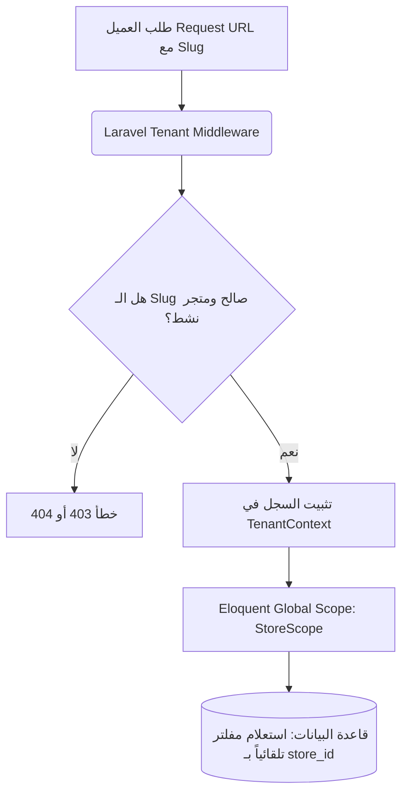
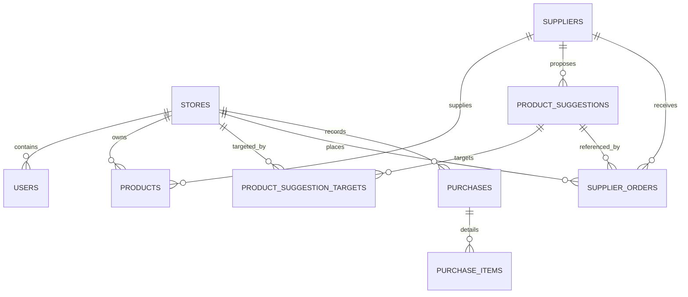
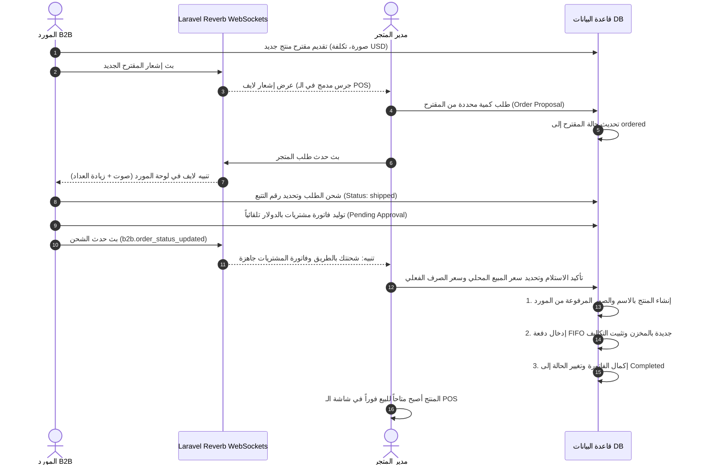

# Software Requirements Specification (SRS) & Technical Architecture Document
## نظام إدارة نقطة البيع الذكي وتدفقات الـ B2B المشتركة (Cash POS)

> [!NOTE]  
> يعتبر هذا المستند المرجع التقني والأساسي (The Source of Truth) لبنية النظام المعمارية، التدفقات البرمجية، وهيكل قاعدة البيانات وميثاق جودة الكود للمطورين الحاليين والمستقبليين في المشروع.

---

## جدول المحتويات (Table of Contents)
1. [الستاك التقني والمعمارية (Tech Stack & Architecture)](#1-الستاك-التقني-والمعمارية-tech-stack--architecture)
   - [التقنيات المستخدمة (Core Stack)](#التقنيات-المستخدمة-core-stack)
   - [هيكلية عزل المتاجر (Multi-Tenancy)](#هيكلية-عزل-المتاجر-multi-tenancy)
   - [هيكل المجلدات الرئيسي (Directory Structure)](#هيكل-المجلدات-الرئيسي-directory-structure)
2. [قاعدة البيانات والجداول (Database Schema & Constraints)](#2-قاعدة-البيانات-والجداول-database-schema--constraints)
   - [الجداول الرئيسية والعلاقات (Schema Mapping)](#الجداول-الرئيسية-والعلاقات-schema-mapping)
   - [القيود وشروط التحقق (Database Constraints)](#القيود-وشروط-التحقق-database-constraints)
3. [الموديولات والميزات الحالية (Modules & Current Features)](#3-الموديولات-والميزات-الحالية-modules--current-features)
   - [نقطة البيع (POS Module)](#نقطة-البيع-pos-module)
   - [بوابة الـ B2B والموردين (B2B & Supplier Portal)](#بوابة-الـ-b2b-والموردين-b2b--supplier-portal)
   - [الإشعارات والويب سوكت (Zero-Reload Live Sync)](#الإشعارات-والويب-سوكت-zero-reload-live-sync)
4. [خرائط التدفق وعمليات الأكشن (Workflows & Action Flows)](#4-خرائط-التدفق-وعمليات-الأكشن-workflows--action-flows)
   - [دورة حياة مقترح منتج B2B (Product Proposal Lifecycle)](#دورة-حياة-مقترح-منتج-b2b-product-proposal-lifecycle)
   - [دورة حياة تسجيل الدخول والتوجيه الذكي (Login & Redirect Lifecycle)](#دورة-حياة-تسجيل-الدخول-والتوجيه-الذكي-login--redirect-lifecycle)
5. [أمثلة الكود الحرج والأساسي (Critical Code Examples)](#5-أمثلة-الكود-الحرج-والأساسي-critical-code-examples)
   - [طباعة الفاتورة الحرارية 80mm وخط Cairo الـ Offline](#أولا-طباعة-الفاتورة-الحرارية-80mm-وخط-cairo-الـ-offline)
   - [الاستماع اللحظي للويب سوكت في الفرونت إند](#ثانيا-الاستماع-اللحظي-للويد-سوكت-في-الفرونت-إند)
   - [نواة عزل المتاجر (StoreScope & BelongsToStore Trait)](#ثالثا-نواة-عزل-المتاجر-storescope--belongstostore-trait)
   - [التوجيه التلقائي بعد تسجيل الدخول (Smart Redirection)](#رابعا-التوجيه-التلقائي-بعد-تسجيل-الدخول-smart-redirection)

---

## 1. الستاك التقني والمعمارية (Tech Stack & Architecture)

### التقنيات المستخدمة (Core Stack)
بُني النظام ليكون قابلاً للتوسع الأفقي والعمودي، ومحصناً ضد انقطاع الشبكة في العمليات الحرجة (مثل الطباعة والمسح):

*   **Backend Core**: `Laravel 11` (PHP 8.2+) يوفر أداءً مميزاً، ونظام حماية متين وأدوات إدارة مهام قوية.
*   **Frontend Core**: `React 18` مع بيئة التطوير فائقة السرعة `Vite`، بالاعتماد على مكوّنات تفاعلية و `React Query` لمزامنة البيانات.
*   **Database**: `PostgreSQL` لإدارة البيانات العلائقية بكفاءة عالية، مع الاعتماد على القيود الصلبة (Database Constraints) لحماية نزاهة البيانات.
*   **Real-Time WebSockets**: `Laravel Reverb` (خادم ويب سوكت داخلي عالي الأداء يعمل على منفذ `8090`) مدمج مع `Laravel Echo` و `Pusher-JS` في الواجهات الأمامية لتوفير مزامنة بدون ريفريش.
*   **Containerization & DevOps**: بيئة عمل `Docker` مؤتمتة بالكامل، مع تقليص حجم حاوية Alpine عبر إزالة أدوات البناء الزائدة والاعتماد فقط على مكتبات التشغيل الضرورية (`libpq`).
*   **Styling & Design System**: واجهة مستخدم مبهرة وجمالية زجاجية (`Glassmorphism`) تعتمد على `TailwindCSS` ومكتبة `Lucide React` للأيقونات، مع خط `Cairo` وخطوط متناسقة، وانتقالات ناعمة تعطي طابع الـ Premium للبرنامج.

---

### هيكلية عزل المتاجر (Multi-Tenancy)
يعتمد النظام على بنية **Multi-tenancy** بنمط **Single Database / Shared Schema** حيث يتم الفصل والعزل بشكل برمجي كامل وآمن:

1.  **التعرف اللحظي عبر المسار (Slug-based Routing)**:
    تحتوي مسارات جميع المتاجر على مُعرّف المتجر `slug` في رابط URL (مثال: `https://cashpos.com/my-store-slug/pos`).
2.  **سياق المتجر المستأجر (TenantContext)**:
    كلاس إستاتيكي في Laravel يقوم باستخراج الـ `slug` عند طلب العميل، ويتحقق من صلاحية المتجر ثم يقوم بتثبيت الـ `store_id` داخل سياق العملية (Request Lifetime).
3.  **العزل التلقائي في قاعدة البيانات (Eloquent Global Scopes)**:
    عبر استخدام تريت `BelongsToStore` وسكوب `StoreScope`، يتم تلقائياً حقن شرط الاستعلام `WHERE store_id = ?` في كل عملية استعلام وقراءة، كما يتم تعيين `store_id` تلقائياً عند حفظ أي سجل جديد، مما يمنع نهائياً أي إمكانية لتسريب أو تداخل البيانات بين المتاجر.



---

### هيكل المجلدات الرئيسي (Directory Structure)

#### هيكلية الباك إند (Laravel Directory Structure)
```text
backend/
├── app/
│   ├── Http/
│   │   ├── Controllers/Api/   # متحكمات الـ API (المبيعات، B2B، المشتريات، الموردين)
│   │   └── Middleware/        # برمجيات وسيطة للتحقق وسياق المتجر
│   ├── Models/                # نماذج البيانات (Product, SupplierOrder, Store, Batch)
│   ├── Notifications/         # الإشعارات اللحظية وقواعد البيانات
│   ├── Scopes/                # سكوبات العزل التلقائي (StoreScope.php)
│   └── Traits/                # خصال الموديل المشتركة (BelongsToStore.php)
├── config/                    # إعدادات النظام ومحرك الـ WebSockets (Reverb)
├── database/
│   ├── migrations/            # ملفات بناء الجداول والقيود
│   └── seeders/               # بذور البيانات الافتراضية
├── routes/                    # المسارات (channels.php للويب سوكت، api.php للملفات)
└── supervisord.conf           # مراقبة خادم Reverb و Queue Workers والـ PHP-FPM
```

#### هيكلية الفرونت إند (React Directory Structure)
```text
frontend/
├── src/
│   ├── api/                   # إعدادات Axios وحقن توكن الحماية تلقائياً
│   ├── components/            # المكونات التفاعلية (BarcodeScanner, PricingModal, UI)
│   ├── context/               # سياق إدارة الجلسات (AuthContext لعمليات التوجيه)
│   ├── hooks/                 # الخطافات المخصصة لإدارة العمليات المتكررة
│   ├── pages/                 # الصفحات الكاملة (لوحة الكاشير POS, لوحة المورد، المشتريات)
│   ├── utils/                 # الخدمات المساعدة (توليد الفواتير الحرارية، خدمات الصوت)
│   ├── App.jsx                # شجرة المكونات وتوزيع المسارات
│   ├── index.css              # إعدادات TailwindCSS، تأثيرات الأنيميشن ومحددات الطباعة
│   └── main.jsx               # نقطة التشغيل الرئيسية للتطبيق
```

---

## 2. قاعدة البيانات والجداول (Database Schema & Constraints)

### الجداول الرئيسية والعلاقات (Schema Mapping)

يعتمد محرك البيانات على مجموعة جداول صلبة لضمان كفاءة سلاسل الإمداد ومزامنة العمليات:



#### جداول بنية البيانات الأساسية (Core Tables)

| اسم الجدول | الوصف | الحقول الأساسية | العلاقات والروابط |
| :--- | :--- | :--- | :--- |
| **`stores`** | المتاجر المشتركة في النظام | `id`, `name`, `slug`, `status` (active/inactive) | - |
| **`users`** | مستخدمو النظام بمختلف الرتب | `id`, `name`, `email`, `password`, `role` (admin/cashier/SUPPLIER/SUPER_ADMIN), `store_id` | `store_id` -> `stores.id` (nullable للـ Super Admin والمورد) |
| **`suppliers`** | الموردون للسلع B2B | `id`, `name`, `user_id`, `store_id` (nullable إذا كان عاماً) | `user_id` -> `users.id`, `store_id` -> `stores.id` |
| **`products`** | المنتجات والسلع المتوفرة للمتجر | `id`, `uuid`, `store_id`, `category_id`, `name`, `barcode`, `stock_quantity`, `min_quantity`, `cost_price` (USD), `price_syr` (local), `price_usd` (sale) | `store_id` -> `stores.id`, `category_id` -> `categories.id` |
| **`product_batches`** | دفعات شحن المنتجات وتدفق FIFO | `id`, `product_id`, `store_id`, `original_quantity`, `remaining_qty`, `cost_usd`, `cost_local`, `sale_price` | `product_id` -> `products.id`, `store_id` -> `stores.id` |

#### جداول مقترحات الـ B2B وسلاسل التوريد (B2B Supply Chain)

| اسم الجدول | الوصف | الحقول الأساسية | العلاقات والروابط |
| :--- | :--- | :--- | :--- |
| **`product_suggestions`** | مقترحات المنتجات التي يطرحها الموردون | `id`, `supplier_id`, `name`, `description`, `image_path`, `category_id`, `price_usd` (التكلفة بالدولار), `status`, `target_all` (bool) | `supplier_id` -> `suppliers.id`, `category_id` -> `categories.id` |
| **`product_suggestion_targets`** | المتاجر المستهدفة بالمقترح المخصص | `id`, `product_suggestion_id`, `store_id` | رابط N-to-N بين `product_suggestions` و `stores` |
| **`supplier_orders`** | طلبات الشراء الموجهة للموردين | `id`, `store_id`, `product_id` (null في البداية), `suggestion_id`, `supplier_id`, `quantity`, `status`, `price_at_order_usd`, `tracking_number` | `store_id` -> `stores.id`, `suggestion_id` -> `product_suggestions.id` |
| **`purchases`** | فواتير المشتريات المستلمة أو المنشأة | `id`, `store_id`, `supplier_id`, `invoice_number` (Unique string), `total_amount` (USD), `exchange_rate`, `status` | `store_id` -> `stores.id`, `supplier_id` -> `suppliers.id` |
| **`purchase_items`** | تفاصيل بنود فواتير الشراء | `id`, `purchase_id`, `product_id` (nullable), `temp_product_name`, `temp_image_path`, `quantity`, `unit_cost_price` | `purchase_id` -> `purchases.id`, `product_id` -> `products.id` |

---

### القيود وشروط التحقق (Database Constraints)

لتحقيق حماية كاملة ومقاومة للبيانات الخاطئة، تم تفعيل قيود صلبة على مستوى قاعدة البيانات (PostgreSQL constraints):

1.  **قيد حالات مقترحات المنتجات (`product_suggestions_status_check`)**:
    يضمن عدم قبول أي حالة عشوائية خارجة عن الحالات الرسمية المحددة لدورة الحياة:
    ```sql
    ALTER TABLE product_suggestions 
    ADD CONSTRAINT product_suggestions_status_check 
    CHECK (status IN ('pending', 'approved', 'rejected', 'ordered'));
    ```
2.  **قيد حالات طلب الموردين (`supplier_orders_status_check`)**:
    يضمن حصر حالات الطلب بين المتجر والمورد في نطاق مغلق:
    ```sql
    CHECK (status IN ('pending', 'processing', 'shipped', 'completed', 'cancelled'))
    ```
3.  **قيد تميز رقم فاتورة المشتريات (`purchases_invoice_number_unique`)**:
    يمنع إدخال فاتورة الشراء الملقمة مرتين بالخطأ، مما يمنع مضاعفة كميات المخازن بصورة وهمية.
4.  **قيد منع تكرار الأهداف (`product_suggestion_targets_unique`)**:
    يمنع استهداف نفس المتجر بمقترح منتج واحد أكثر من مرة عبر تفعيل Unique Index ثنائي على الحقول `(product_suggestion_id, store_id)`.

---

## 3. الموديولات والميزات الحالية (Modules & Current Features)

### نقطة البيع (POS Module)

يعد موديول الكاشير العمود الفقري للواجهة الأمامية للمتجر، وقد صُمم لتلبية معايير السرعة الفائقة والاعتمادية دون توقف:

*   **معالجة المبيعات اللحظية (Reactive Cart Management)**: لوحة كاشير متكاملة تدعم تصفية المنتجات السريعة، إدخال فوري للكميات، حساب الخصومات تلقائياً، ودعم خيارات الدفع الفوري (نقدي) أو الآجل (ذمم) مع مرونة تامة لربط العملاء بالذمم المالية عبر `DebtLedger`.
*   **ماسح الباركود المتطور (Barcode Scanner Integration)**:
    يحتوي التطبيق على مكون `BarcodeScanner` مدمج ومبني عبر مكتبة `html5-qrcode`. يدعم قراءة الباركود المتعددة بصورة لحظية باستخدام كاميرا الأجهزة المحمولة مع تركيز تلقائي، تقليل معدل الفريمات لتقليص جهد البطارية، والتحقق الآمن من السياق (Secure Context Required), والاهتزاز الفعلي للهاتف عند نجاح المسح لتوفير بيئة عمل تشبه أجهزة الكاشير الفيزيائية.
*   **الطباعة الحرارية المباشرة (80mm Thermal Receipts)**:
    استبدال النظام بالكامل من توليد ملفات PDF (والتي تبطئ العملية وتتطلب موافقة يدوية) إلى الطباعة الحرارية الصرفة عبر المتصفح باستخدام واجهات الـ Web API للطباعة.
    *   **خط Cairo دون إنترنت (Offline Font Loading)**: لمنع انقطاع مظهر الفاتورة أو تشوه اللغة العربية في حالة عدم الاتصال بالسيرفر، يتم قراءة خط `Cairo` بنمط Base64 كود مباشر وحقنه ديناميكياً داخل المستند المطبوع.
    *   **توليد الـ QR Code للتحقق الداخلي**: تحتوي كل فاتورة مطبوعة في أسفلها على رمز استجابة سريعة QR Code مولد محلياً وبشكل لحظي بالكامل، يحتوي على بيانات الفاتورة ورابط التحقق الداخلي بالصيغة:
        `http://asus-lp.local:5173/{store_slug}/invoices/{invoice_number}`.
*   **نظام التوجيه التلقائي للمستخدمين**:
    سلوك ذكي ومخصص حسب الأدوار عند تسجيل الدخول، لتقليص خطوات وصول الموظف لوجهته:
    *   **Cashier & Admin**: يتم تحويلهما تلقائياً إلى صفحة نقطة البيع مباشرة `/{slug}/pos` للاستجابة السريعة وتوفير الوقت.
    *   **Supplier & Super Admin**: تحويل مباشر إلى لوحات الإدارة المركزية والتقارير المجمعة.

---

### بوابة الـ B2B والموردين (B2B & Supplier Portal)

أقوى موديولات النظام لربط المتاجر المستقلة بالمستودعات المركزية وسلاسل الإمداد دون الحاجة للاتصال اليدوي:

1.  **لوحة اقتراح السلع (Product Proposals Submission)**:
    يستطيع المورد رفع مقترحات بضائع تشمل الاسم، الوصف، الفئة المستهدفة، صور المنتج، وسعر التكلفة بالدولار `price_usd` لضمان حماية الأسعار ضد التضخم وتقلب العملات.
2.  **خيارات الاستهداف المرنة (Flexible Target Selection)**:
    يدعم المقترح الاستهداف العام لجميع المشتركين (`target_all = true`) أو توجيه المنتج لمتجر أو متاجر محددة بالاسم (سري وخاص) عبر جدول الوسيط `product_suggestion_targets`.
3.  **إدارة دورة حياة الطلبات (Order State Flow)**:
    متابعة آلية لتطور حالة بضائع التوريد من مجرد مقترح، لطلب فوري، لجاري المعالجة، لمشحون مع تسجيل رقم التتبع `tracking_number` التلقائي، وصولاً للاستلام التام.
4.  **نظام التسعير ومقاومة تقلب العملات**:
    تتم جميع عمليات التوريد وحساب التكاليف بالدولار الأميركي `$`. وعند قيام المتجر بتأكيد استلام الطلبية الشاحنة، يُعرض عليه سعر الصرف الفعلي الحالي بالعملة المحلية، ويسجل النظام التكاليف تلقائياً بناءً على العملتين في جدول الدفعات `product_batches` لضمان دقة الهوامش المالية وحساب الأرباح الفعلية بدقة رياضية.

---

### الإشعارات والويب سوكت (Zero-Reload Live Sync)

لتحقيق تجربة مستخدم رائدة خالية من تحديث الصفحة اليدوي (Reload-Free Experience)، يدعم النظام تدفقاً ديناميكياً للبيانات اللحظية:

*   **المزامنة الحية لإشعار الطلب**: عند ضغط الكاشير أو مدير المتجر على زر "طلب المقترح"، يُطلق الباك إند حدث `NewSupplierOrderEvent` والذي يلتقطه خادم `Laravel Reverb` فوراً ليرسله للوحة تحكم المورد المفتوحة في المتصفح، مما يُطلق صوتاً تنبيهياً يوقظ المورد ويرفع عداد الطلبات مع تحديث القائمة فوراً دون أي ريفريش.
*   **المزامنة الحية لإشعار الشحن**: عند قيام المورد بضغط زر "شحن الطلب" في لوحته، يطلق النظام حدث `B2BOrderStatusEvent` على القناة الخاصة بالمتجر (`private-stores.{store_id}`)، تلتقط الواجهات الأمامية للمتجر في صفحة `PurchasesPage` هذا الإرسال فوراً، وتُحدث بيانات الجدول تلقائياً بوجود شحنة جديدة بانتظار الاعتماد.

---

## 4. خرائط التدفق وعمليات الأكشن (Workflows & Action Flows)

### دورة حياة مقترح منتج B2B (Product Proposal Lifecycle)

يعبر المخطط التالي عن دورة الحياة المتكاملة للمنتج منذ اقتراحه من قبل المورد في بوابة الـ B2B وحتى استلامه في مخزن متجر الكاشير وتوفره للبيع للجمهور:



---

### دورة حياة تسجيل الدخول والتوجيه الذكي (Login & Redirect Lifecycle)

عند تسجيل الدخول في الواجهة الأمامية، يمر المستخدم بالمسار التالي لضمان أسرع وصول ممكن للمهمة الأساسية:

```mermaid
graph TD
    A[إدخال البريد وكلمة المرور] --> B(إرسال طلب التحقق لـ API Login)
    B --> C{هل البيانات صحيحة؟}
    C -- لا --> D[إظهار خطأ التحقق والمحاولة مجدداً]
    C -- نعم --> E[حفظ التوكن والسياق في المتصفح]
    E --> F{ما هي رتبة الموظف؟}
    F -- SUPER_ADMIN --> G[توجيه مباشر لـ /super-admin]
    F -- SUPPLIER --> H[توجيه مباشر لـ /supplier-portal]
    F -- admin أو cashier --> I[استخراج الـ Slug للمتجر المرتبط]
    I --> J[توجيه فوري ومباشر لواجهة الـ POS: /{slug}/pos]
```

---

## 5. أمثلة الكود الحرج والأساسي (Critical Code Examples)

### أولاً: طباعة الفاتورة الحرارية 80mm وخط Cairo الـ Offline
يوضح الكود التالي كيفية حقن مصفوفة الخط العربي كـ Base64 مباشر مع تفعيل محددات الطباعة وأسلوب الـ `@media print` لضمان خروج فاتورة 80mm حرارية ممتازة من أي متصفح دون اتصال إنترنت:

```javascript
// مقتطف من ملف src/utils/invoiceGenerator.js
import { CAIRO_FONT } from './CairoFont'; // يحتوي على الخط Base64
import QRCode from 'qrcode';

export const generateInvoice = async (order, items, store = null) => {
    const storeName = store?.name || 'Cash POS';
    const invoiceNo = order.invoice_number || order.id;
    const date = new Date(order.created_at || Date.now()).toLocaleString('ar-SY');

    // 1. توليد كود التحقق الداخلي QR Code محلياً
    const qrContent = `متجر: ${storeName}\nرقم الفاتورة: ${invoiceNo}\nالإجمالي: ${order.total_amount} ل.س\nرابط: http://asus-lp.local:5173/${store?.slug}/invoices/${invoiceNo}`;
    const qrDataUrl = await QRCode.toDataURL(qrContent, { margin: 1, width: 150 });

    // 2. صياغة قالب HTML المتكامل للطباعة الحرارية
    const receiptHtml = `
        <!DOCTYPE html>
        <html dir="rtl">
        <head>
            <meta charset="UTF-8">
            <style>
                @font-face {
                    font-family: 'Cairo';
                    src: url(data:font/ttf;base64,${CAIRO_FONT}) format('truetype');
                    font-weight: normal;
                    font-style: normal;
                }
                @page {
                    size: 80mm auto;
                    margin: 0;
                }
                body {
                    width: 80mm;
                    margin: 0;
                    padding: 3mm;
                    font-family: 'Cairo', sans-serif;
                    font-size: 11px;
                    line-height: 1.3;
                    color: #000;
                    background-color: #fff;
                }
                .container { width: 74mm; margin: 0 auto; }
                .text-center { text-align: center; }
                .bold { font-weight: bold; }
                .separator { border-top: 1px dashed #000; margin: 8px 0; }
                table { width: 100%; border-collapse: collapse; }
                th { border-bottom: 1px dashed #000; padding: 4px 0; font-size: 10px; }
                td { padding: 5px 0; font-size: 10px; }
                .qr-container { text-align: center; margin: 15px 0; }
                .qr-container img { width: 110px; height: 110px; }
                
                @media print {
                    body { width: 80mm; }
                    .no-print { display: none; }
                }
            </style>
        </head>
        <body>
            <div class="container">
                <div class="text-center bold" style="font-size: 16px;">${storeName}</div>
                <div class="text-center" style="font-size: 9px;">رقم الفاتورة: #${invoiceNo}</div>
                <div class="separator"></div>
                <table>
                    <thead>
                        <tr>
                            <th class="text-right">الصنف</th>
                            <th>الكمية</th>
                            <th class="text-left">الإجمالي</th>
                        </tr>
                    </thead>
                    <tbody>
                        ${items.map(item => `
                            <tr>
                                <td class="bold">${item.name}</td>
                                <td class="text-center">${item.quantity}</td>
                                <td class="text-left">${(item.quantity * item.price).toLocaleString()} ل.س</td>
                            </tr>
                        `).join('')}
                    </tbody>
                </table>
                <div class="separator"></div>
                <div class="bold" style="font-size: 14px; display: flex; justify-content: space-between;">
                    <span>المبلغ المطلوب:</span>
                    <span>${Number(order.total_amount).toLocaleString()} ل.س</span>
                </div>
                <div class="qr-container">
                    
                </div>
                <div class="text-center" style="font-size: 9px;">شكراً لتعاملكم معنا</div>
            </div>
            <script>
                window.onload = () => {
                    window.print();
                    setTimeout(() => { window.close(); }, 500);
                };
            </script>
        </body>
        </html>
    `;

    // 3. فتح النافذة الفرعية وإصدار الأمر للطابعة الحرارية مباشرة
    const printWindow = window.open('', '_blank', 'width=400,height=600');
    printWindow.document.write(receiptHtml);
    printWindow.document.close();
};
```

---

### ثانيا: الاستماع اللحظي للويب سوكت في الفرونت إند
يوضح الكود التالي كيفية إنشاء قناة الاستماع الخاصة بالمتجر وتلقي التحديثات بدون الحاجة لعمل ريفريش للصفحة، مع إشراك تنبيهات الصوت وعرض التحديثات في جدول المشتريات:

```javascript
// مقتطف من ملف src/pages/PurchasesPage.jsx
import echo from '../utils/echo';
import SoundService from '../utils/SoundService';
import { toastSuccess } from '../utils/swal';

useEffect(() => {
    if (isAuthenticated && user?.store_id) {
        // 1. الاشتراك في القناة الخاصة بالمتجر ديناميكياً
        const channel = echo.private(`stores.${user.store_id}`);
        
        // 2. الاستماع لحدث تحديث حالة التوريد والوصول
        channel.listen('.b2b.order_status_updated', (eventData) => {
            console.log('[Live Status Update] Received via Reverb:', eventData);
            
            if (eventData.status === 'shipped') {
                // إطلاق صوت تنبيه الكاشير
                SoundService.playNotification();
                
                // إظهار إشعار زجاجي منبثق جذاب
                toastSuccess(`🚚 تم الشحن: المورد شحن منتج (${eventData.product_name}). الفاتورة بالانتظار!`);
                
                // إعادة طلب البيانات لتحديث القائمة لحظياً دون ريفريش
                fetchAllPurchasesList(); 
            }
        });

        // 3. تنظيف الاشتراك عند الخروج من الصفحة لمنع تسريب الذاكرة
        return () => {
            echo.leave(`stores.${user.store_id}`);
        };
    }
}, [isAuthenticated, user?.store_id]);
```

---

### ثالثا: نواة عزل المتاجر (StoreScope & BelongsToStore Trait)
فيما يلي البنية الأساسية التي تُؤمن عزل البيانات تلقائياً في الباك إند:

#### 1. Scope العزل التلقائي لقاعدة البيانات (`app/Scopes/StoreScope.php`)
```php
namespace App\Scopes;

use Illuminate\Database\Eloquent\Builder;
use Illuminate\Database\Eloquent\Model;
use Illuminate\Database\Eloquent\Scope;
use App\Models\TenantContext;

class StoreScope implements Scope
{
    public function apply(Builder $builder, Model $model): void
    {
        // 1. إذا كان المستخدم Super Admin ولا يوجد سياق متجر مفروض (سياق عام) يرى كل شيء
        if (auth()->check() && auth()->user()->role === 'SUPER_ADMIN' && !TenantContext::isSet()) {
            return;
        }

        // 2. إذا تم فرض سياق المتجر (عبر الـ Middleware بناءً على الـ Slug)
        if (TenantContext::isSet()) {
            $builder->where($model->getTable() . '.store_id', TenantContext::getStoreId());
            return;
        }

        // 3. حماية افتراضية بناءً على المتجر المرتبط بحساب المستخدم العادي
        if (auth()->check() && auth()->user()->store_id) {
            $builder->where($model->getTable() . '.store_id', auth()->user()->store_id);
        }
    }
}
```

#### 2. التريت المشترك للنماذج العلائقية (`app/Traits/BelongsToStore.php`)
```php
namespace App\Traits;

use App\Scopes\StoreScope;
use Illuminate\Database\Eloquent\Model;
use App\Models\TenantContext;

trait BelongsToStore
{
    protected static function bootBelongsToStore()
    {
        // إضافة سكوب الفلترة التلقائية
        static::addGlobalScope(new StoreScope);

        // حقن معرّف المتجر تلقائياً عند إنشاء أي سجل جديد بالمشروع
        static::creating(function (Model $model) {
            if ($model->getAttribute('store_id')) {
                return;
            }

            if (auth()->check()) {
                $user = auth()->user();
                $storeId = ($user->role === 'SUPER_ADMIN') ? TenantContext::getStoreId() : $user->store_id;

                if ($storeId) {
                    $model->setAttribute('store_id', $storeId);
                }
            }
        });
    }

    public function store()
    {
        return $this->belongsTo(\App\Models\Store::class);
    }
}
```

---

### رابعاً: التوجيه التلقائي بعد تسجيل الدخول (Smart Redirection)
آلية توجيه المستخدمين في سياق الواجهات الأمامية استناداً إلى الصلاحيات والأدوار، من كود الـ `AuthContext.jsx`:

```javascript
// مقتطف من ملف src/context/AuthContext.jsx
const handleLogin = (token, userData, slug) => {
    localStorage.setItem('pos_token', token);
    localStorage.setItem('pos_user', JSON.stringify(userData));
    if (slug) localStorage.setItem('pos_slug', slug);

    setToken(token);
    setUser(userData);
    if (slug) setSlug(slug);

    // نظام التوجيه التلقائي والذكي (Smart Redirect Routing Service)
    if (userData.role === 'SUPER_ADMIN') {
        window.location.href = '/super-admin';
    } else if (userData.role === 'SUPPLIER') {
        window.location.href = '/supplier-portal';
    } else if (slug) {
        // تحويل فوري لصفحة الكاشير والمبيعات عند تطابق رتبة المتجر
        if (userData.role === 'admin' || userData.role === 'cashier') {
            window.location.href = `/${slug}/pos`;
        } else {
            window.location.href = `/${slug}/dashboard`;
        }
    } else {
        window.location.href = '/';
    }
};
```

---

> [!IMPORTANT]  
> يلتزم المبرمجون باتباع معايير عزل البيانات (Store Isolation) عبر التريت المخصص، وعدم إجراء أي استعلامات مباشرة تتجاوز `BelongsToStore` إلا في حالات الإحصائيات الشاملة بلوحة الـ Super Admin وتتم بشكل صريح عبر السلسلة التابعة: `withoutGlobalScopes()`.
